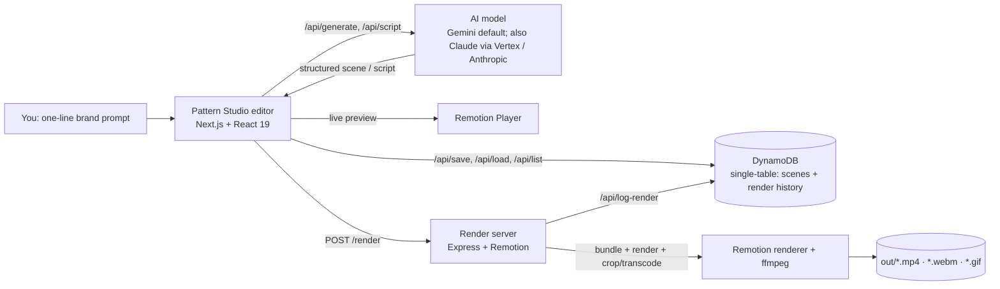

# Pattern Studio

**Design a broadcast‑quality animated title in your browser — edit every part of it — and export a real MP4, in seconds.**

Pattern Studio is a motion‑graphics studio for creators. A deterministic, seeded **pattern engine** composes bold editorial title cards — heavy condensed type, a brand palette, and scattered geometric shapes — which you tweak in a **live editor** and export to **MP4 / WebM / GIF** in any aspect ratio. It puts the kind of title animation that normally needs a motion designer and After Effects right into the browser. *(Want a head start? Describe a brand in a sentence and it drafts an editable scene for you.)*

---

## The problem

High‑end motion graphics are a bottleneck for creators, founders, and small teams. A single animated brand title can cost hundreds of dollars or hours in After Effects, and the skills don't transfer to non‑designers. Template tools look generic; pro tools are too hard. *(There's a full ~70s narrated breakdown in the [Problem statement video](public/examples/pattern-studio-problem.mp4).)*

## The solution

Pattern Studio collapses that to: **design → editable scene → MP4.**

- **A procedural pattern engine** — a deterministic, seeded generator scatters 16 kinds of geometric shape around heavy condensed type and drives the animation; the same scene renders identically every time, so the live preview and the final MP4 match frame‑for‑frame.
- **Live editor** — drag titles, adjust density/proximity/stagger, pick shapes and brand colours, give **each title box its own colour**, add music/SFX, toggle a grid, save/load scenes.
- **Two motion styles, deeply controllable** — *scatter* (shapes cluster around the title) or a *flood* intro with **6 fill styles** (random, sweep, radial, rows, columns, edges‑in), solid‑or‑mixed colour, and speed / tile‑size / shape sliders, plus stays‑or‑clears.
- **Audio‑reactive** — shapes and dots pulse in time with the music.
- **Export any aspect ratio, any format** — render to **16:9, 3:2, 4:3, 5:4, 1:1, 4:5, or 9:16** as **MP4, WebM, or GIF**; the server renders once at full 1080p, then center‑crops and transcodes each output with ffmpeg (the design stays intact).
- **One‑click export** — a render server bundles the scene with [Remotion](https://www.remotion.dev) and renders a real H.264 MP4.
- **Your work is saved** — scenes and render history persist per user in **DynamoDB**, so you can come back to anything you've made.
- **Optional fast start** — describe a brand in a sentence and the studio drafts a starting scene (title, palette, layout, shapes) straight into the editor, fully editable from there.

---

## Videos — all made *with* Pattern Studio

Every film below was produced in the tool itself (Remotion compositions in the same editorial style), with free neural voiceovers:

| Film | What it is |
|---|---|
| 🎬 [**Promo**](public/examples/pattern-studio-promo.mp4) | ~37s narrated product film — prompt → scene → render |
| ❓ [**Problem statement**](public/examples/pattern-studio-problem.mp4) | ~71s narrated explainer of the problem we solve |
| 🎞️ [**Examples montage**](public/examples/pattern-studio-examples.mp4) | six brands designed in the studio, each shown with its one‑line brief |
| 🏗️ [**Architecture explainer**](public/examples/pattern-studio-architecture.mp4) | how the editor → API → AI → Remotion pipeline works |

---

## Example scenes — each from a one‑line prompt

|  |  |
|---|---|
|  |  |
| *“Ember — a warm, rustic coffee roaster”* | *“Neon Nights — a summer music festival”* |
|  |  |
| *“Maison Noir — a luxury couture atelier”* | *“Wild North — an outdoor travel brand”* |

Animated `.mp4` versions of all six are in [`public/examples/`](public/examples).

## Architecture



- **Editor + API** (`app/`, `components/`) — Next.js 16 + React 19 with the Remotion Player. API routes hold all **AI calls server‑side** (keys/credentials never reach the browser) and read/write scenes and render history in DynamoDB.
- **Data layer** (`app/lib/db.ts`) — a **DynamoDB single‑table design**: every user owns one item collection, holding both saved scenes and render‑history events, retrievable with single‑partition Queries (no Scans). A sparse GSI lists a user's scenes by recency.
- **Render server** (`server/render-server.mjs`) — Express backend that renders MP4s with `@remotion/renderer`, then derives every aspect ratio and format (MP4/WebM/GIF) from one base render with ffmpeg.
- **Compositions** (`src/compositions/`) — the animated graphics (titles + the demo films), defined in React + [Remotion](https://www.remotion.dev) with Zod‑typed props.
- **Pattern engine** (`src/lib/patterngen/`) — a deterministic, seeded generator that scatters shapes/squares/dots around the title, plus the flood‑grid intro (see [Attribution](#attribution)).

---

## Tech stack

| Area | Tech |
| --- | --- |
| Frontend / editor | Next.js 16, React 19, TypeScript, Tailwind 4, Radix UI |
| Video / animation | Remotion 4, `@remotion/player`, `@remotion/media-utils` (audio‑reactive) |
| Render backend | Node, Express 5, `@remotion/bundler` + `@remotion/renderer`, ffmpeg |
| Database | **AWS DynamoDB** (single‑table; `@aws-sdk/lib-dynamodb`) |
| AI | **Google Gemini** (`gemini-2.5-flash`) via Google AI Studio (`@google/genai`); a provider‑agnostic layer also runs Claude on **Vertex AI** / the **Anthropic API** |
| Schemas / validation | Zod 4 |
| Demo videos | Rendered in Remotion; free **Edge neural TTS** voiceovers; **ffmpeg** for aspect‑ratio crops |

---

## Getting started

```bash
npm install
cp .env.example .env      # then edit (see below)
```

**Connect an AI provider** — pick one in `.env`:

```bash
# Option A — Google Gemini (free key from https://aistudio.google.com)
CLAUDE_PROVIDER=gemini
GEMINI_API_KEY=...
GEMINI_MODEL=gemini-2.5-flash

# Option B — Claude on Google Vertex AI (GCP credits; gcloud ADC + granted quota)
# CLAUDE_PROVIDER=vertex
# ANTHROPIC_VERTEX_PROJECT_ID=your-gcp-project-id
# CLOUD_ML_REGION=global

# Option C — first-party Anthropic API
# CLAUDE_PROVIDER=anthropic
# ANTHROPIC_API_KEY=sk-ant-...
```

**Connect DynamoDB** (for save / load / render history) in `.env`:

```bash
AWS_REGION=us-east-1
AWS_ACCESS_KEY_ID=...
AWS_SECRET_ACCESS_KEY=...
AWS_DYNAMODB_TABLE_NAME=pattern-studio
```

```bash
npm run setup:db          # creates the single table + GSI1 if they don't exist
```

**Run it** (two terminals):

```bash
npm run dev        # editor + API → http://localhost:3000
npm run server     # MP4 render backend → http://localhost:3001
```

Then open the editor, type a brand description in **✨ AI Brand**, hit **Generate Scene**, edit, pick an aspect ratio/format, and **Render**.

**Other commands:**

```bash
npm run studio                   # Remotion Studio (browse/scrub all compositions)
npm run typecheck                # tsc --noEmit
npm run build                    # production build (Next.js)
npx remotion render PatternTitle out/title.mp4 --codec=h264 --crf=18
```

---

## How the AI works

`POST /api/generate` sends your prompt to the model (Google Gemini by default) with a system prompt that frames it as a brand/motion designer and specifies an exact JSON shape. The route then **validates and clamps every field** (coordinates to 0–1, sizes and slider ranges to their bounds, shape ids to the known set, colours to valid hex) before returning it — the model's output is never trusted blindly. The result maps 1:1 onto the `PatternTitle` composition's Zod schema, so it renders immediately and stays editable.

`POST /api/script` returns a short, structured voiceover script (hook → problem → solution → CTA) for the demo video. `POST /render` (render server) renders the scene to an MP4 and, for non‑16:9 ratios or other formats, derives the output with ffmpeg; the render is logged to DynamoDB.

Both AI routes run on whichever provider `.env` selects — Gemini, Claude on Vertex, or the Anthropic API — a one‑line change.

---

## Why render needs its own server

The editor, AI routes, and DynamoDB all run happily on **Vercel**. **MP4 rendering does not** — and can't. Remotion's renderer launches **headless Chromium + ffmpeg**, runs for tens of seconds, and writes files to disk: that exceeds the time, size, and filesystem limits of Vercel (and any "edge" runtime). So rendering lives in a separate long‑running process, `server/render-server.mjs`.

- **Local / demo:** run `npm run server` and use the app on the same machine — the editor calls the render server at `http://localhost:3001`.
- **Production:** host the render server on a long‑running box (an **AWS EC2** instance, or the serverless **[Remotion Lambda](https://www.remotion.dev/docs/lambda)** → S3 path), then set `NEXT_PUBLIC_RENDER_SERVER` to its URL in Vercel and redeploy. The editor reads that env var (`components/editor/constants.ts`); everything else is unchanged.

Generate / edit / save all work on the deployed site today; only the final MP4 export needs the render server reachable.

## Why DynamoDB

Pattern Studio uses a **single‑table design**: one table holds every entity type. Each user owns one *item collection* (all items sharing their `USER#<id>` partition key), so:

- a user's scenes and render history live together and come back in **one single‑partition Query** — never a table Scan;
- **ownership is enforced by the key**, not application code — a caller can only ever address items inside their own partition;
- a **sparse GSI** lists scenes by most‑recently‑edited, while render events omit the index attributes so they never cost anything on it.

See `app/lib/db.ts` for the full access‑pattern documentation.

---

## Roadmap

- Brand‑kit memory (logo, fonts, palette reused across scenes)
- More intro transitions and shape packs
- Template library + direct social publishing
- Hosted render queue for scalability beyond a single machine

---

## Attribution

This project stands on open work — full details in [`NOTICE.md`](NOTICE.md):

- The pattern‑placement engine in `src/lib/patterngen/` is **ported and adapted from [`patterngen-oss`](https://github.com/halfof8/patterngen) by halfof8 (MIT)**. Pattern Studio re‑implements it to be Remotion‑native and deterministic, and builds a new product around it (the live editor, the MP4 render pipeline, the flood intro, and the AI scene/script generation).
- [Remotion](https://www.remotion.dev) (video framework — see its own license), **Google Gemini** & Anthropic Claude (AI), Microsoft **Edge neural TTS** (voiceovers), Google Fonts **Anton** & **Shippori Mincho** (OFL), and **CC0** music/SFX.

## License

[MIT](LICENSE) © 2026 Trishit Bodkhe
