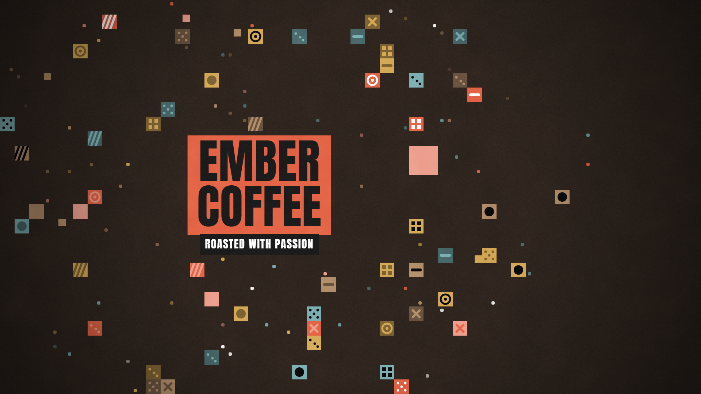
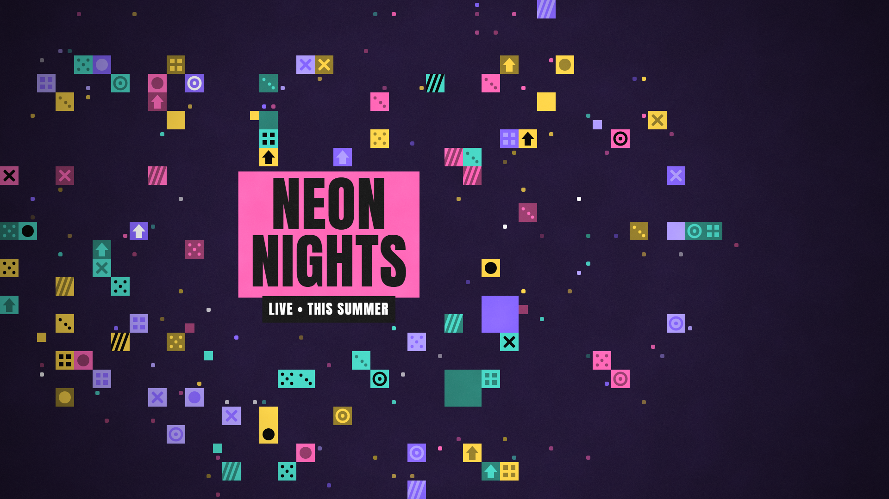
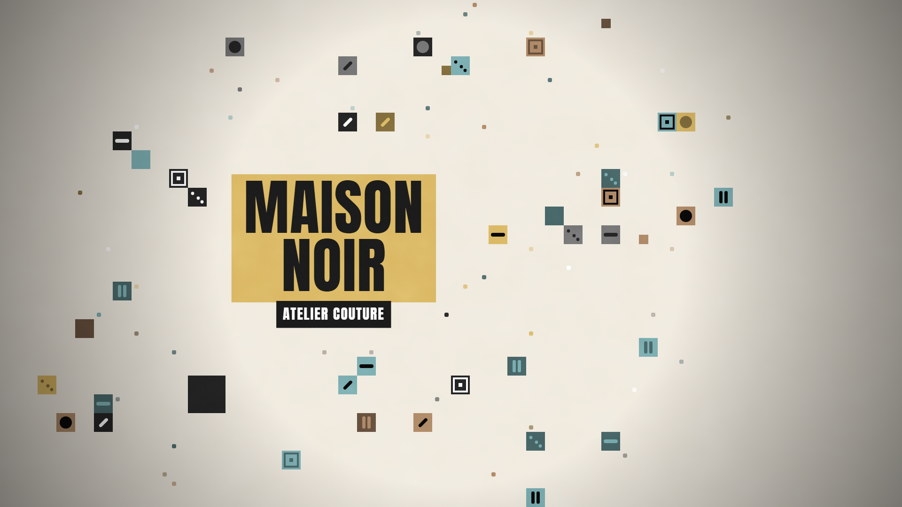
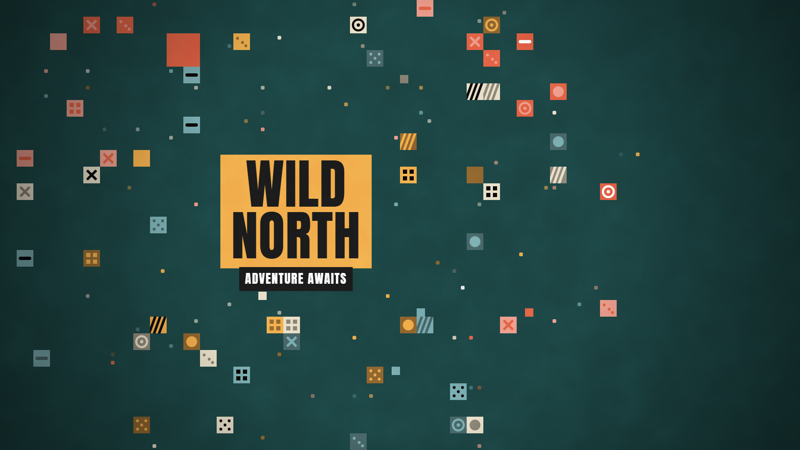
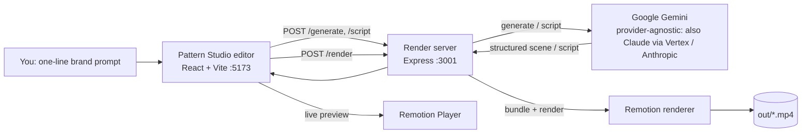

# Pattern Studio

**Describe your brand in a sentence — get a broadcast‑quality animated title, rendered to MP4, in seconds.**

Pattern Studio is an AI‑assisted motion‑graphics tool. You type a one‑line description of a brand, product, or topic; Claude designs a complete title scene — headline, palette, geometric pattern, and layout; you tweak anything in a live editor; and you export a finished MP4 with one click. It puts the kind of bold, editorial title animation that normally needs a motion designer into the hands of anyone who can type a sentence.

> Built for **UOE Summer of Code 2026** · Theme: **Open Innovation**

---

## The problem

High‑end motion graphics are a bottleneck for creators, founders, and small teams. A single animated brand title can cost hundreds of dollars or hours in After Effects, and the skills don't transfer to non‑designers. Template tools look generic; pro tools are too hard.

## The solution

Pattern Studio collapses that to: **prompt → editable scene → MP4.**

- **AI brand‑from‑a‑prompt** — Google Gemini acts as a brand designer: from your description it returns a full scene (title text, sub‑label, colour palette, which of 16 geometric shapes to scatter, density/proximity, and layout coordinates) as validated, structured data that drops straight into the editor.
- **AI script‑writer** — one click writes a 45–75s voiceover script for your demo/brand video.
- **Live editor** — drag titles, adjust density/proximity/stagger, pick shapes and brand colours, add music/SFX, toggle an alignment grid, save/load scenes as JSON. Everything the AI generates stays fully editable.
- **One‑click MP4** — a local render server bundles the scene with [Remotion](https://www.remotion.dev) and renders a real H.264 MP4.
- **Motion styles** — a *scatter* intro (shapes cluster around the title) or a *flood* intro (a full-screen colour grid sweeps in, then clears to reveal the title), plus optional *audio-reactive* pulsing synced to the music.
- **Ready‑made films** — composed openers (`Intro`, `Assembly`) you can brand and export as polished bookends.

---

## Demo

> 📹 Narrated promo film: [`public/examples/pattern-studio-promo.mp4`](public/examples/pattern-studio-promo.mp4) — ~37s, made entirely with the tool, neural voiceover.
> 🏗️ Architecture explainer: [`public/examples/pattern-studio-architecture.mp4`](public/examples/pattern-studio-architecture.mp4) — ~34s, narrated walkthrough of how the system works, in the same editorial style · 🖼️ Screenshots: `docs/` _(add)_

A typical flow: type *“Ember — a warm, rustic specialty coffee roaster”* → **Generate Scene** → the editor fills with an on‑brand title, earthy palette, and scattered shapes → drag the title, tweak a slider → **Render** → download the MP4.

---

## Example scenes — each from a one‑line prompt

|  |  |
|---|---|
|  |  |
| *“Ember — a warm, rustic coffee roaster”* | *“Neon Nights — a summer music festival”* |
|  |  |
| *“Maison Noir — a luxury couture atelier”* | *“Wild North — an outdoor travel brand”* |

Animated `.mp4` versions of all six are in [`public/examples/`](public/examples), with a browsable gallery at `/examples/index.html` when the app is running.

## Architecture



- **Editor** (`app/`) — React + Remotion Player; designs the scene and previews it live.
- **Render server** (`server/render-server.mjs`) — Express backend. Holds all Claude calls **server‑side** (the API key/credentials never reach the browser), and renders MP4s with `@remotion/renderer`.
- **Compositions** (`src/compositions/`) — the actual animated graphics, defined in React + [Remotion](https://www.remotion.dev) with Zod‑typed props.
- **Pattern engine** (`src/lib/patterngen/`) — a deterministic, seeded generator that scatters shapes/squares/dots around the title (see [Attribution](#attribution)).

---

## Tech stack

| Area | Tech |
| --- | --- |
| Video / animation | Remotion 4, React 19, TypeScript |
| Editor | Vite 8, `@remotion/player` |
| Backend | Node, Express 5, `@remotion/bundler` + `@remotion/renderer` |
| AI | **Google Gemini** (`gemini-2.5-flash`) via Google AI Studio (`@google/genai`); a provider-agnostic layer also runs Claude on **Vertex AI** / the **Anthropic API** |
| Schemas / validation | Zod 4 |
| Optional AI image | Local ComfyUI (Stable Diffusion img2img) watercolour pass |

---

## Getting started

```bash
npm install
cp .env.example .env      # then edit (see below)
```

**Connect an AI provider** — pick one in `.env`:

```bash
# Option A — Google Gemini (free key from https://aistudio.google.com)
CLAUDE_PROVIDER=gemini
GEMINI_API_KEY=...
GEMINI_MODEL=gemini-2.5-flash

# Option B — Claude on Google Vertex AI (GCP credits; gcloud ADC + granted quota)
# CLAUDE_PROVIDER=vertex
# ANTHROPIC_VERTEX_PROJECT_ID=your-gcp-project-id
# CLOUD_ML_REGION=global

# Option C — first-party Anthropic API
# CLAUDE_PROVIDER=anthropic
# ANTHROPIC_API_KEY=sk-ant-...
```

**Run it** (two terminals):

```bash
npm run server     # render + AI backend → http://localhost:3001
npm run app        # editor → http://localhost:5173
```

Then open the editor, type a brand description in **✨ AI Brand**, hit **Generate Scene**, edit, and **Render**.

**Other commands:**

```bash
npm run studio -- --port=3999    # Remotion Studio (browse/scrub all compositions)
npm run typecheck                # tsc --noEmit
npx remotion render PatternTitle out/title.mp4 --codec=h264 --crf=18 --port=4001
```

---

## How the AI works

`POST /generate` sends your prompt to the model (Google Gemini by default) with a system prompt that frames it as a brand/motion designer and specifies an exact JSON shape. The server then **validates and clamps every field** (coordinates to 0–1, sizes and slider ranges to their bounds, shape ids to the known set, colours to valid hex) before returning it — the model's output is never trusted blindly. The result maps 1:1 onto the `PatternTitle` composition's Zod schema, so it renders immediately and stays editable.

`POST /script` returns a short, structured voiceover script (hook → problem → solution → CTA) for the demo video.

Both run on whichever provider `.env` selects — Gemini, Claude on Vertex, or the Anthropic API — a one‑line change.

---

## Roadmap

- Social export presets (9:16 Reels/Shorts, 1:1) and template library
- Audio‑reactive patterns (beat‑synced shape/scale animation)
- Brand‑kit memory (logo, fonts, palette reused across scenes)
- Hosted render queue for scalability beyond a single machine

---

## Attribution

This project stands on open work — full details in [`NOTICE.md`](NOTICE.md):

- The pattern‑placement engine in `src/lib/patterngen/` is **ported and adapted from [`patterngen-oss`](https://github.com/halfof8/patterngen) by halfof8 (MIT)**. Pattern Studio re‑implements it to be Remotion‑native and deterministic, and builds a new product around it (the live editor, the MP4 render pipeline, and the AI scene/script generation).
- [Remotion](https://www.remotion.dev) (video framework — see its own license), Anthropic Claude (AI), Google Fonts **Anton** & **Shippori Mincho** (OFL), and **CC0** music/SFX.

## License

[MIT](LICENSE) © 2026 Trishit Bodkhe
